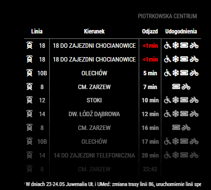

# MMM-MPKLodz

**MMM-MPKLodz** is a module for [MagicMirror²](https://github.com/MagicMirrorOrg/MagicMirror).  
It displays live public transport departures from MPK Łódź (buses and trams).

This module fetches real-time data from the [ITS Łódź public API](http://rozklady.lodz.pl) and shows upcoming departures for a selected stop.

> **Disclaimer:** This module is unofficial and not affiliated with MPK Łódź, ZDiT, or ITS. Data is publicly available and provided by the City of Łódź / ITS Łódź.

---

## 🚦 Status

**Maintained** – feedback, issues, and contributions are welcome!

---

## 🖼️ Screenshot



---

## 📦 Installation

```bash
cd ~/MagicMirror/modules
git clone https://github.com/Xioner19/MMM-MPKLodz.git
cd MMM-MPKLodz
npm install
```
## 🌍 Translations

This module supports the following languages:

- 🇬🇧 English (`en`)
- 🇵🇱 Polish (`pl`)
- 🇩🇪 German (`de`)
- 🇺🇦 Ukrainian (`uk`)

## ⚙️ Configuration

Add the module to the `modules` array in the `config/config.js` file:

```js
{
  module: "MMM-MPKLodz",
  position: "bottom_right", // Or any region
  config: {
    stopId: "572",           // Your stop ID
    fade: true,              // Enable fading effect
    fadePoint: 0.25,         // Start fading after 25%
    maxEntries: 10,          // Max departures to show
    redThreshold: 2,         // Highlight departures within X minutes
    showAmenities: true      // Show vehicle features (e.g. Vehicle equipped with air conditioning etc)
  }
}


```

### 🧩 Options

| Option          | Description                                                               |
|-----------------|---------------------------------------------------------------------------|
| `stopId`        | The ID of the stop you want to display departures for. (Default: `"572"`) |
| `fade`          | Whether to fade the list of departures. (Default: `true`)                 |
| `fadePoint`     | Where to start the fade effect. (Default: `0.25`)                         |
| `maxEntries`	  | Max number of departures to display (Default: `10`)                       |
| `redThreshold`	| Minutes before departure to trigger red/blink alert (Default: `2`)        |
| `showAmenities`	| Show vehicle features (e.g. bike, card, AC, low floor) (Default: `true`)  |

## 🛑 How to find your `stopId`

You need the `stopId` for the station whose departures should be displayed.

Here's how to find out the `stopId`:

1. Go to [mpk.lodz.pl](https://www.mpk.lodz.pl/)
2. Go to Stops
3. Select the stop you are interested in
4. Copy and paste the `stopId` from the browser bar

## Contributing

Pull requests, suggestions and bug reports are very welcome. Please use [GitHub Issues](https://github.com/Xioner19/MMM-MPKLodz/issues) to report bugs or request features.


## License

This project is licensed under the MIT License - see the [LICENSE](LICENSE.md) file for details.
