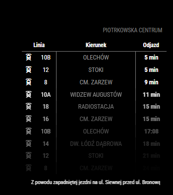

# MMM-MPKLodz

MMM-MPKLodz is a module for the [MagicMirror](https://github.com/MagicMirrorOrg/MagicMirror) project by [Xioner19](https://github.com/Xioner19).

It shows live public transport information for Lodz based on [rozklady.lodz.pl](http://rozklady.lodz.pl/) data. 

## Status

The current development status of this module is: **maintained**

This means: I'm open for feature requests, pull requests, bug reports, ...

## Screenshot

The module looks like this:



## Installation

1. Clone this repository in your `modules` folder:
    ```bash
    cd ~/MagicMirror/modules
    git clone https://github.com/Xioner19/MMM-MPKLodz.git
    ```

2. Install the dependencies:
    ```bash
    cd MMM-MPKLodz
    npm install
    ```

3. Add the module to your `config/config.js` file:
    ```js
    {
      module: "MMM-MPKLodz",
      position: "bottom_right", // Or any other region
      config: {
        stopId: "572", // Your stop ID
        updateInterval: 60000,
        fade: true,
        fadePoint: 0.25,
      }
    }
    ```
## How to get the `stationId`

You need the `stopId` for the station whose departures should be displayed.

Here's how to find out the `stopId`:

1. Go to [mpk.lodz.pl](https://www.mpk.lodz.pl/)
2. Go to Stops 	
3. Select the stop you are interested in
4. Copy and paste the `stopId` from the browser bar

## Configuration Options

| Option          | Description                                                               |
|-----------------|---------------------------------------------------------------------------|
| `stopId`        | The ID of the stop you want to display departures for. (Default: `"572"`) |
| `updateInterval`| Time in milliseconds between updates. (Default: `60000`)                  |
| `fade`          | Whether to fade the list of departures. (Default: `true`)                 |
| `fadePoint`     | Where to start the fade effect. (Default: `0.25`)                         |

## Dependencies

- [puppeteer](https://www.npmjs.com/package/puppeteer)

## Issues

If you find any problems, bugs or have questions, please [open a GitHub issue](https://github.com/Xioner19/MMM-MPKLodz/issues) in this repository.
